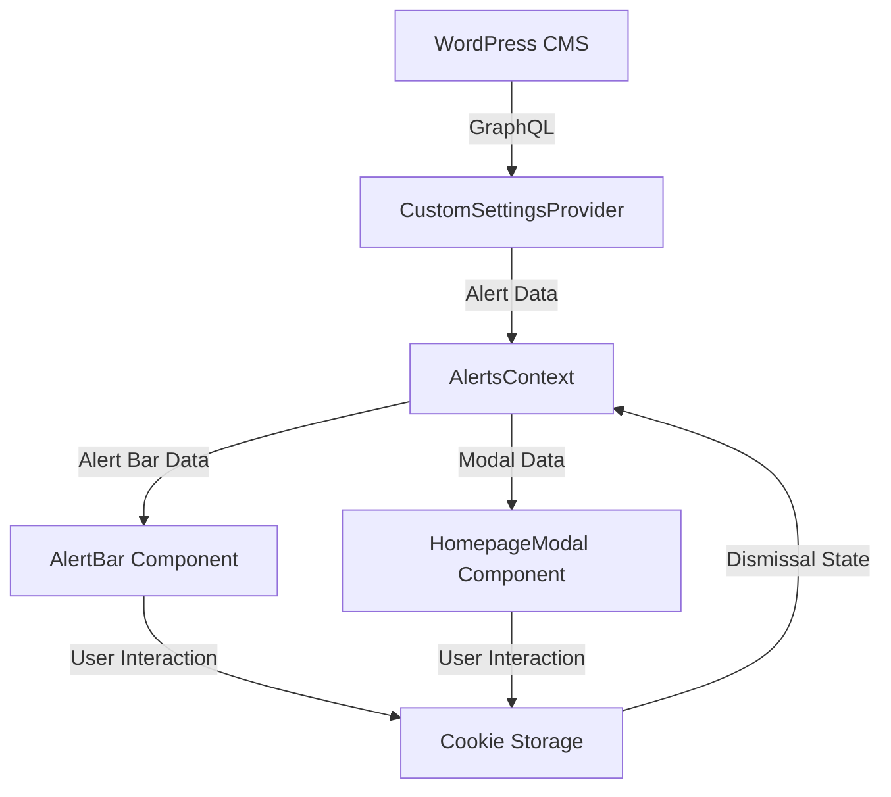

# Design Document: Alerts Feature

## Overview

The Alerts Feature will provide a system for displaying two types of alerts to users on the Wilmington College website:

1. **Alert Bar**: A dismissible notification bar that appears at the top of every page when published
2. **Modal Popup**: A dismissible modal that can appear either globally or on specific pages

Both alert types will be managed through WordPress and retrieved via GraphQL. The feature will extend the existing alert functionality by adding support for page-specific modals and improving the data structure to accommodate both alert types.

## Architecture

The alerts feature will follow the existing architecture patterns of the application:

1. **Data Layer**: GraphQL queries to fetch alert data from WordPress
2. **State Management**: React Context API for managing alert state
3. **UI Components**: React components for rendering alerts
4. **Persistence**: Browser cookies for storing user dismissal preferences

### Data Flow



## Components and Interfaces

### 1. Data Types

```typescript
// Alert Types
interface BaseAlert {
  id: number
  status: string
  date: string
  alertType: 'alert-bar' | 'popup-modal'
}

interface AlertBarData extends BaseAlert {
  alertMsgTitle: string
  alertMessage: string
  alertButtonLabel: string
  alertButtonUri: string
  buttonLabel: string
  buttonUrl: string
}

interface PopupModalData extends BaseAlert {
  popupTitle: string
  popupContent: string
  popupVisibilityPage: string | null
  buttonLabel: string
  buttonUrl: string
  popupImage: {
    altText: string
    id: number
    sourceUrl: string
  } | null
}

type Alert = AlertBarData | PopupModalData

// Context Interface
interface AlertsContextType {
  alerts: Alert[]
  dismissAlert: (id: number) => void
  isDismissed: (id: number) => boolean
}
```

### 2. CustomSettingsProvider (Extended)

The existing `CustomSettingsProvider` will be extended to fetch and provide both alert types. The GraphQL query will be updated to include all necessary fields for both alert types.

```typescript
// Updated GraphQL query
const alertsQuery = gql`
  query GetAlerts {
    alerts {
      nodes {
        id
        alertMsgTitle
        alertType
        alertMessage
        alertButtonLabel
        alertButtonUri
        buttonLabel
        buttonUrl
        content
        date
        popupContent
        popupTitle
        popupVisibilityPage
        popupImage {
          altText
          id
          sourceUrl
        }
        status
      }
    }
  }
`
```

### 3. AlertsContext

A new context will be created to manage alerts state and provide methods for dismissing alerts.

```typescript
// AlertsContext.tsx
export const AlertsContext = createContext<AlertsContextType>({
  alerts: [],
  dismissAlert: () => {},
  isDismissed: () => false
})

export const AlertsProvider: React.FC<{ children: ReactNode }> = ({
  children
}) => {
  const { data } = useQuery(alertsQuery)
  const [dismissedAlerts, setDismissedAlerts] = useState<
    Record<number, boolean>
  >({})

  // Load dismissed alerts from cookies on mount
  useEffect(() => {
    // Implementation
  }, [])

  // Save dismissed alerts to cookies
  const dismissAlert = (id: number) => {
    // Implementation
  }

  // Check if alert is dismissed
  const isDismissed = (id: number) => {
    return dismissedAlerts[id] || false
  }

  return (
    <AlertsContext.Provider
      value={{ alerts: data?.alerts?.nodes || [], dismissAlert, isDismissed }}
    >
      {children}
    </AlertsContext.Provider>
  )
}
```

### 4. AlertBar Component (Updated)

The existing `AlertBar.tsx` component will be updated to use the new alerts data structure and context.

```typescript
// AlertBar.tsx
const AlertBar: React.FC = () => {
  const { alerts, dismissAlert, isDismissed } = useContext(AlertsContext)

  // Find the first published alert-bar type alert
  const alertBarData = alerts.find(
    (alert) =>
      alert.alertType === 'alert-bar' &&
      alert.status === 'publish' &&
      !isDismissed(alert.id)
  ) as AlertBarData | undefined

  if (!alertBarData) return null

  return <div className={styles.alertBar}>{/* Implementation */}</div>
}
```

### 5. HomepageModal Component (Converted to TypeScript)

The `HomepageModal.js` component will be converted to TypeScript and updated to use the new alerts data structure and context.

```typescript
// HomepageModal.tsx
const HomepageModal: React.FC = () => {
  const { alerts, dismissAlert, isDismissed } = useContext(AlertsContext)
  const router = useRouter()
  const currentPath = router.asPath.split('/').pop() || ''

  // Find the first published popup-modal type alert that matches the current page or is global
  const modalData = alerts.find(
    (alert) =>
      alert.alertType === 'popup-modal' &&
      alert.status === 'publish' &&
      !isDismissed(alert.id) &&
      (!alert.popupVisibilityPage || alert.popupVisibilityPage === currentPath)
  ) as PopupModalData | undefined

  if (!modalData) return null

  return <div className={styles.modalWrapper}>{/* Implementation */}</div>
}
```

### 6. Cookie Utility

A utility module will be created to handle cookie operations in a type-safe manner.

```typescript
// cookieUtils.ts
export const setCookie = (
  name: string,
  value: string,
  options?: CookieOptions
): void => {
  // Implementation
}

export const getCookie = (name: string): string | null => {
  // Implementation
}

export const removeCookie = (name: string): void => {
  // Implementation
}
```

## Data Models

### WordPress Alert Data Model

The alerts feature will use the existing WordPress "Alert" custom post type, which will be extended to include the following fields:

- `alertType`: String field to distinguish between 'alert-bar' and 'popup-modal'
- `alertMsgTitle`: String field for the alert bar title
- `alertMessage`: String field for the alert bar message
- `alertButtonLabel`: String field for the alert bar button label
- `alertButtonUri`: String field for the alert bar button URL
- `buttonLabel`: String field for the button label (used by both types)
- `buttonUrl`: String field for the button URL (used by both types)
- `popupTitle`: String field for the modal popup title
- `popupContent`: String field for the modal popup content
- `popupVisibilityPage`: String field for the page slug where the modal should appear (null/empty for global)
- `popupImage`: Media field for the modal popup image

### Client-Side Data Model

On the client side, the alerts will be stored in the AlertsContext and made available to components. The dismissed state will be stored in cookies with the following format:

```
dismissedAlert_[alertId]=true
```

## Error Handling

1. **GraphQL Query Errors**: The CustomSettingsProvider will handle GraphQL query errors and provide fallback behavior.
2. **Missing Data**: Components will check for the existence of required data before rendering.
3. **Cookie Access**: The cookie utility will handle cases where cookies are disabled or inaccessible.

## Testing Strategy

### Unit Tests

1. Test the AlertsContext provider to ensure it correctly manages alert state
2. Test the cookie utility functions
3. Test the AlertBar component with various alert configurations
4. Test the HomepageModal component with various modal configurations

### Integration Tests

1. Test the integration between the CustomSettingsProvider and AlertsContext
2. Test the integration between AlertsContext and alert components
3. Test the cookie persistence across page loads

### User Acceptance Testing

1. Verify that alert bars appear correctly on all pages when published
2. Verify that modal popups appear correctly on specified pages
3. Verify that dismissing alerts persists across page loads
4. Verify that alerts with non-publish status do not appear
